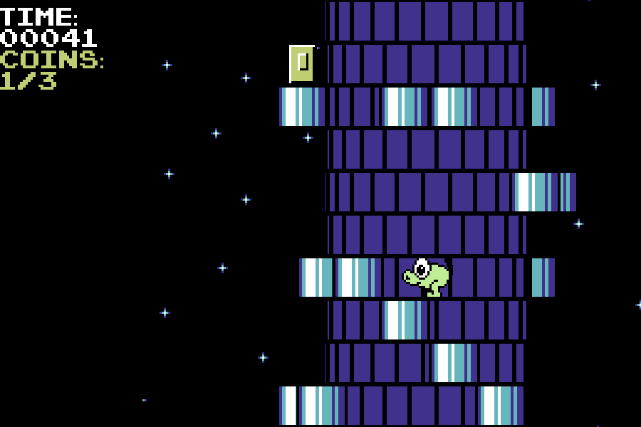

# Froggy (a.k.a. frog_game)

Froggy is a 2.5D platformer game / tech demo developed in January
2022 as an assignment for Yandex Lyceum's "Basics of industrial 
programming" course. The game took heavy inspiration
from the 1987 home computer game Nebulus.

## Running the game

* Clone this github repository
* Install all dependencies from [requirements.txt](requirements.txt)
* Run [main.py](main.py)

## Features:

* 3D-like tower rotation implemented using trigonometric functions
* Collectable coins
* Jump physics with acceleration taken into account
* Time record system
* 2 levels (more can be added into [worlds.txt](worlds.txt))

## Assets used

* The frog sprites are taken from the C64 version of Nebulus
  (posted on "The Spriters Resource")
* The goal plate on top of the tower is taken from 
Sonic the Hedgehog 2 (Sega Master system version)
* "Pixel Emulator" font is used in the GUI
* Platform and coin sprites made by myself

## Project structure

* [key_test.py](key_test.py) was used to find out the key codes.
* [levels_in_text.py](levels_in_text.txt) is where the 
levels are stored in human-readable format. # is used for platforms,
0 is used for coins, spaces are used for blank cells.
Numbers above each level are the number of lines and 
the amount of coins, respectively.
* [main.py](main.py) includes all the game logic.
* [Pixel_Emulator.ttf](Pixel_Emulator.ttf) is the font used in GUI.
* [records.txt](records.txt) is where the game stores the records
for each level.
* [requirements.txt](requirements.txt) lists all dependencies.
* [world_converter.py](world_converter.py) converts the levels
from the [levels_in_text.py](levels_in_text.txt) format into the
[worlds.txt](worlds.txt) (the latter is used by the game).
Levels are converted one at a time.
* [worlds.txt](worlds.txt) is where the game code reads level data
from. Each line of the level grid is saved as a ternary number
  (0 for blank cell, 1 for platform, 2 for coin) converted into 
decimal.
* All sprites are stored in [data](data).